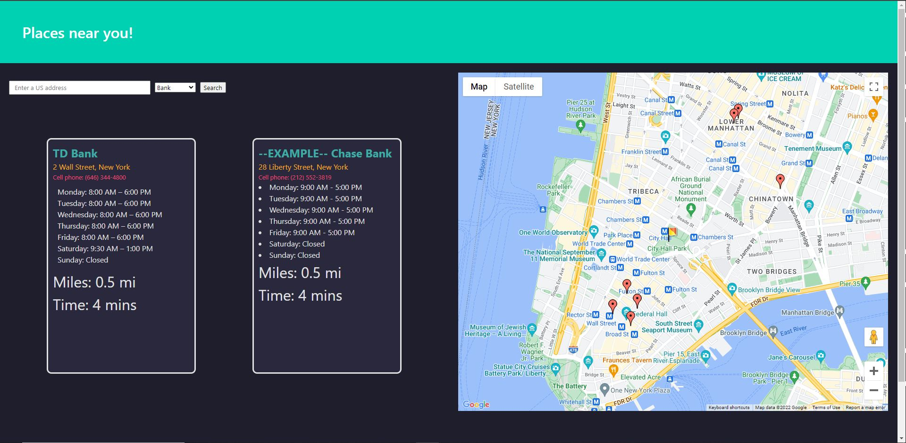

# Proximity
Created by Myles, Jose, and Caleb

## Description
a location based navigation application designed to give users an alternative way to use maps. The main purpose of Proximity is to view the available options nearby a chosen destination. On vacation and need to find an ATM nearby your hotel? Traveling for work and need close access to a pharmacy? Our app will help you view and locate the options available to you.

The app can be used by entering in a location in the U.S., either a general state or city, or even a specific address. After choosing a category (i.e. Restaurant, Bank, or Pharmacy) and clicking Search, a map on the right side of the screen will populate with the location and all of the nearby locations matching the category, within a specific distance radius in relation to the user input.

The primary areas of code and technology that were focused are as follows:
* We used the Bulma framework to aid in our CSS organization and creation
* Through the Google Maps Platform, we utilized various APIs from Maps, Routes, and Places
* Navigated and edited extensive JavaScript code in order to utilized Google's Maps Platform API
* Used various pseudo variables to create custom color variables in the CSS, colors that follow a strict color palette that matches our project presentation

### Deployed Application
https://domomyles.github.io/Proximity/

*Picture:

